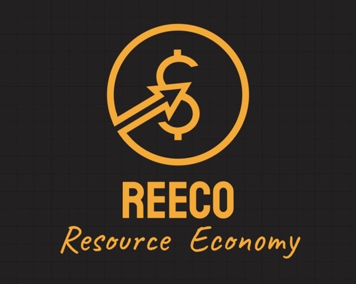
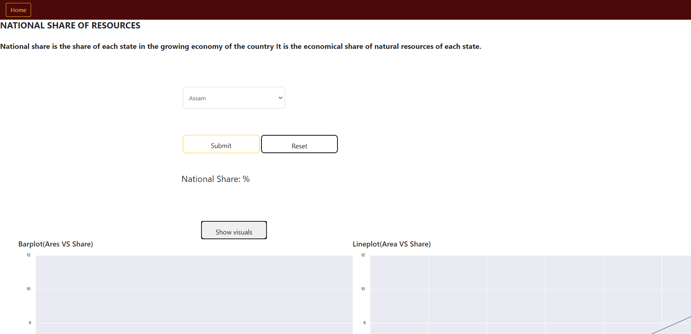
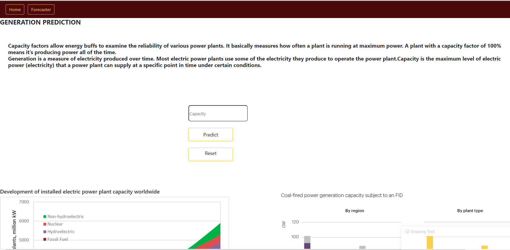
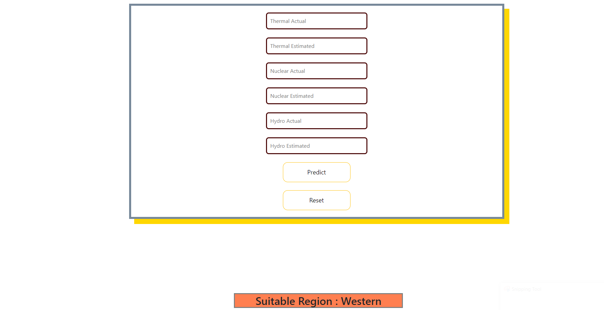
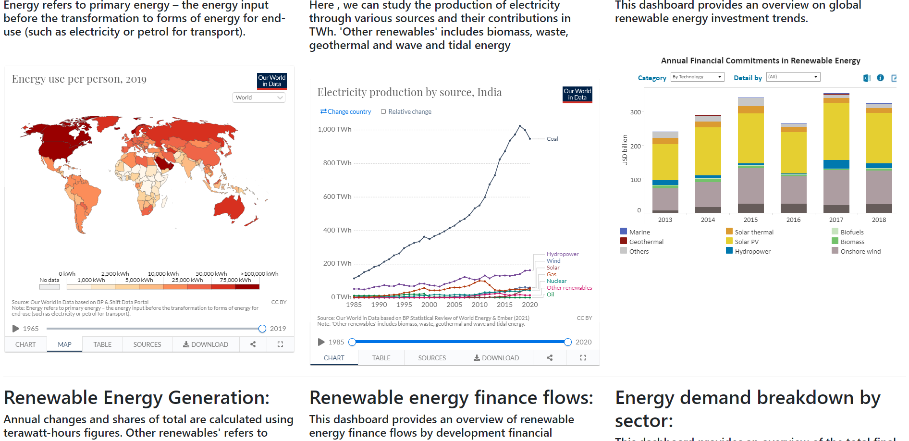
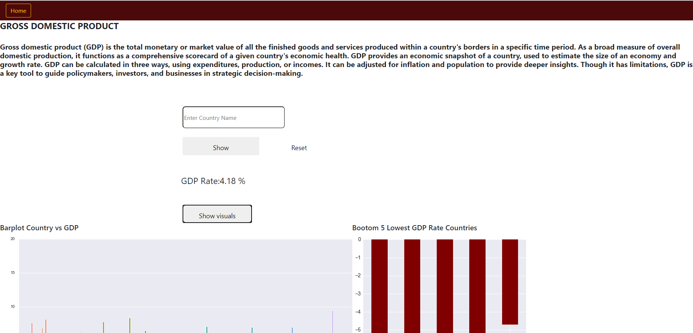
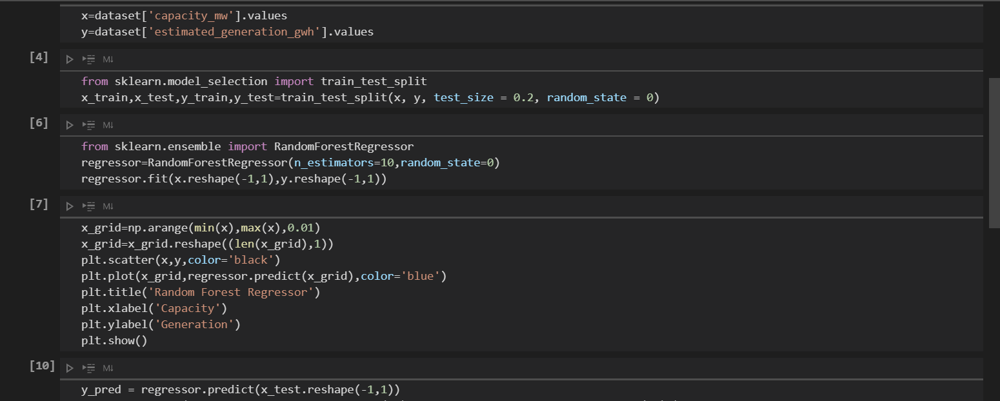
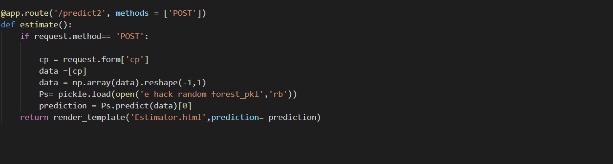
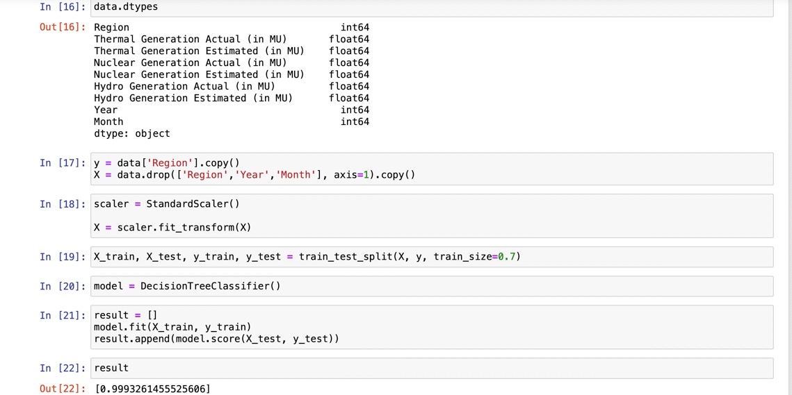

# REECO
## Table of contents
* [Information](#project-information)
* [Video](#intro-video)
* [Screenshots](#screenshots)
* [Technologies](#technologies)
* [Features](#features)
* [Status](#status)
* [Contact](#contact)

## PROJECT INFORMATION 
* REECO aims at providing service oriented industrialists and cooperate sector a platform to understand the global natural resources share and future feasibility of projects or power plants they tend to establish .
* The reasons to invest in natural resources have always been compelling. Whether it's hydro, thermal, or nuclear, natural resources are at the core of production.
The pool of investable natural resources is growing as the world population requires more and more of these resources.
Also , natural resources boosts the Indian Economy

## INTRO VIDEO

CLICK THE LOGO TO WATCH

## Screenshots

## Technologies
* Machine Learning 
* Data Mining 
* Data analytics and  visualisations 
* Data Science 
* Business Analytics
* Tableau
* Flask 
* mySQL database

## Code Examples

## Features

* HOME 
* ESTIMATOR
* FORECASTER
* GDP GROWTH
* NATIONAL SHARE
* IMPORT/EXPORT 

## Status
Project done 

## Contact
Created by [Chiranthana R R](https://www.linkedin.com/in/chiranthana-r-r-232385200/) - feel free to contact me!

Created by [Timsal Zehra](https://www.linkedin.com/in/timsal-zehra-43863b1a6) - feel free to contact me!
